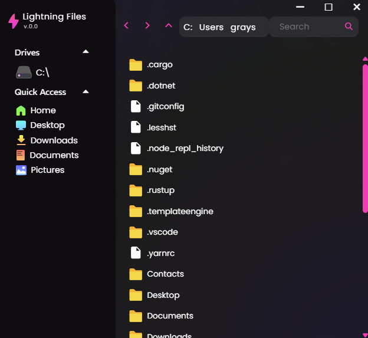

# Lightning Files

An in-development File Explorer made to be cross-platform (currently, only Windows is supported at the moment,) as well as have an emphasis on speed and ease-of-use.

> NOTE: this project is in a proof-of-concept state at the moment. It is not fully functional yet.

Screenshot of the main interface.

# Contributing

If you are interested, then please let me know.
